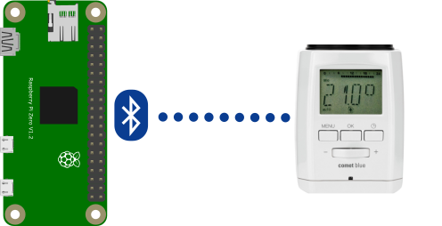

# UC-10 Comet Blue

Comet Blue is a thermostatic valve produced by [Eurotronic Technology Gmbh](https://eurotronic.org/) controlled via Bluetooth Low Energy. Wscgo is able to provide an MQTT interface for it compatible to [HomeAssistant HVAC protocol](https://www.home-assistant.io/integrations/climate.mqtt/).

Using this feature requires a Bluetooth LE adapter to be available on the device and [bluez](http://www.bluez.org/) to be installed.



## Configuration

```ini
[mqtt]
host = tcp://127.0.0.1:1883

[cometblue:1]
name = Comet Blue 1
mac = 11:22:33:44:55:66
duration = 600
current_temperature_topic = home/cb1/current
temperature_state_topic = home/cb1/state
temperature_command_topic = home/cb1/set
```
