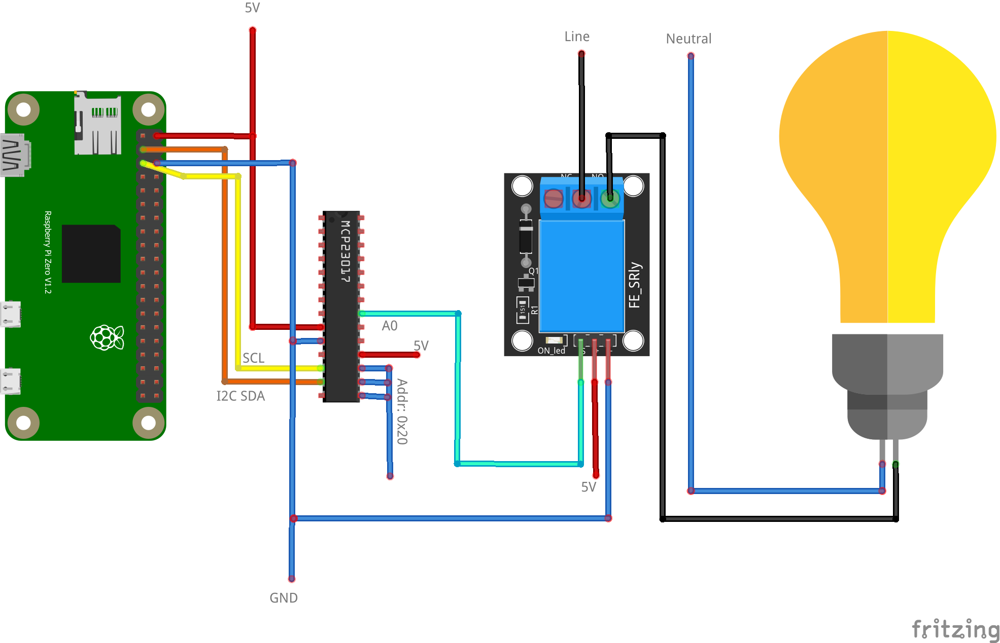

# UC-2 Driving load via relay connected to IO extender



## Configuration

```ini
[mqtt]
host = tcp://127.0.0.1:1883

[mcp23017]
address = 0x20

[switch:0]
name = Relay
topic = home/relay/0
pin = MCP23017_20_PORTA_0
```

> Relay by [arduinomodules](https://arduinomodules.info/ky-019-5v-relay-module/)\
> Bulb by [alfreddagenais](https://github.com/alfreddagenais/fritzing-components/)