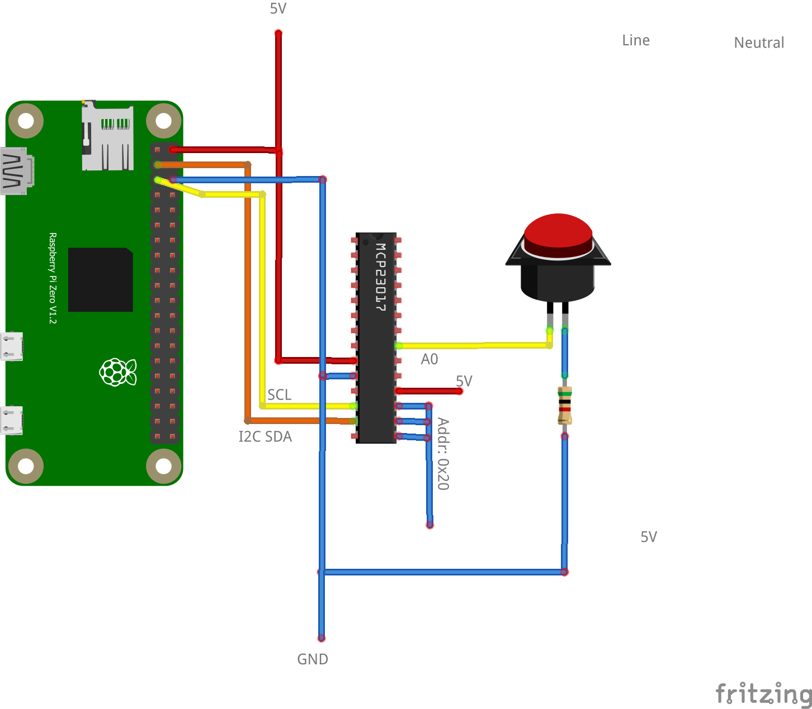

# UC-4 Digial input via IO extender



## Configuration

```ini
[mqtt]
host = tcp://127.0.0.1:1883

[plugin]
path = /usr/local/lib/wscgo-wpi-rpizw.so

[mcp23017]
address = 0x20
expansionBase = 100

[dinput:0]
name = Button
state_topic = home/relay/0
pin = 100
```