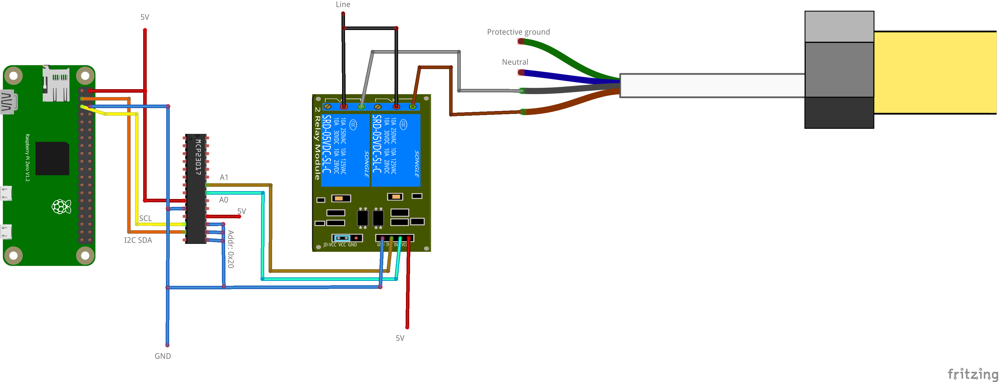

# UC-5 Shutter connection via IO extender and relay board



## Configuration

```ini
[mqtt]
host = tcp://127.0.0.1:1883

[mcp23017]
address = 0x20

[shutter:0]
name = testShutter
topic = test/shutter/0
position_topic = test/shutter/0/state
uppin = MCP23017_20_PORTA_0
downpin = MCP23017_20_PORTA_1
dirswitchwait = 20
range = 120
```