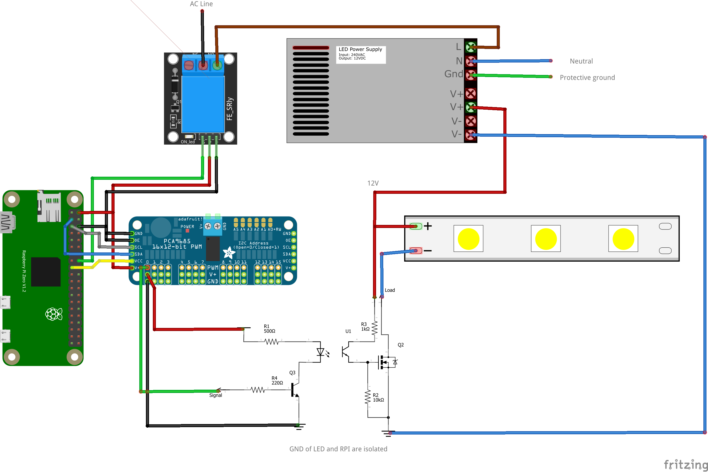

# UC-8 Dimmed light without galvanic isolation

In this scenario the power supply of the raspberry pi and the LED is galvanically isolated.



## Configuration

```ini
[mqtt]
host = tcp://127.0.0.1:1883

[pca9685]
address = 0x40
frequency = 1000

[light:light1]
topic = home/light1
pwmpin = PCA9685_40_0
name = Light 1
speed = 200000
ondelay = 1
onpin = GPIO23
```
> Relay by [arduinomodules](https://arduinomodules.info/ky-019-5v-relay-module/)\
> PCA9685 breakout board from [Adafruit](https://github.com/adafruit/Fritzing-Library/blob/master/parts/retired/PCA9685%2016x12-bit%20PWM%20Breakout.fzpz)